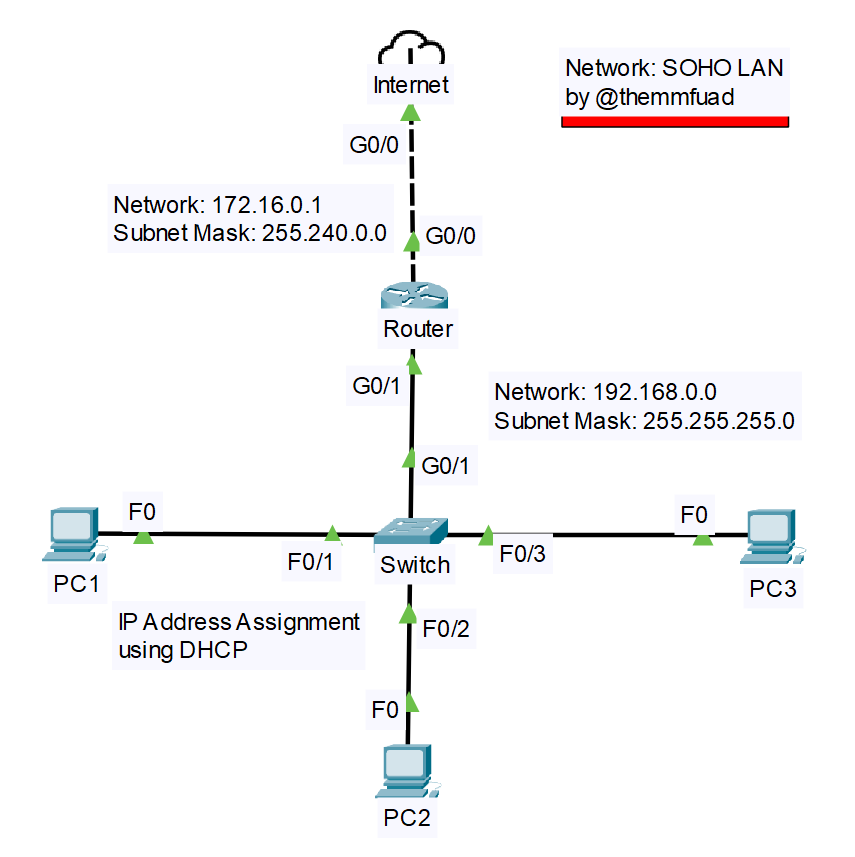

# CCNA-Practice-Projects: N1 (CCNAPPN1)
# SOHO-LAN: Network in Cisco Packet Tracer
# by @themmfuad



# # Internet

**Details:**

- PID(Product IDentifier): Cisco 2901 router (CISCO2901/K9)

## **Configurations**  
### ** For connecting to the Router:

- **Internet(config)#interface g0/0**  
  <small>// go the the interface the "Internet" is connected to"</small>
- **Internet(config-if)#no shutdown**  
  <small>// enable that interface, because cisco router interfaces are administratively down by default</small>
- **Internet(config-if)#ip address 172.16.0.1 255.240.0.0**  
  <small>// assign an IP address for this interface, remember the opposite device's interface's IP address should also be in the same class of IP addresses</small>
- **Internet(config)#ip route 192.168.0.0 255.255.255.0 172.16.0.2**  
<small>// set the routing address of the PC's network in the routing table</small>

---------------------------------------------

# # Router

**Details:**

- PID(Product IDentifier): Cisco 2901 router (CISCO2901/K9)

## **Configurations**  
### ** For connecting to the Internet:

- **Router(config)#interface g0/0**
- **Router(config-if)#no shutdown**
- **Router(config-if)#ip address 172.16.0.2 255.240.0.0**

### ** For connecting to the Switch:

- **Internet(config)#interface g0/1**  
  <small>// go the the interface the "Switch" is connected to"</small>
- **Internet(config-if)#no shutdown**  
  <small>// enable that interface, because cisco router interfaces are administratively down by default</small>

### ** For connecting to other devices via the switch by creating a DHCP server on this router:

- **R1(config)# ip dhcp pool RouterDHCP**  
  <small>// create a new DHCP pool named "RouterDHCP"</small>
- **R1(dhcp-config)# network 192.168.0.0 255.255.255.0**  
  <small>// set the network range to use for the DHCP server</small>
- **R1(dhcp-config)# default-router 192.168.0.1**  
  <small>// set the default gateway for clients of this DHCP pool</small>
- **R1(dhcp-config)# dns-server 8.8.8.8**  
  <small>// set the DNS server for clients of this DHCP pool </small>
- **Router(config)#interface g0/1**  
  <small>// go the interface configuration mode, where DHCP should run</small>
- **R1(config-if)# ip address 192.168.0.1 255.255.255.0**  
  <small>// enable the DHCP server on that interface</small>
- **R1(config-if)# no shutdown**

---------------------------------------------

# # Switch

**Details:**

- PID(Product IDentifier): Cisco Switch WS-C2960-24TT-L

## **Configurations**  
### ** For connecting to the Router:

- **No command is needed**

---------------------------------------------

# # PC(1,2,3)

## **Configurations**  
### ** For connecting to the Internet:

- **Change the IP address assignment process from static to DHCP or run this command in the command prompt ```ipconfig/renew```**
